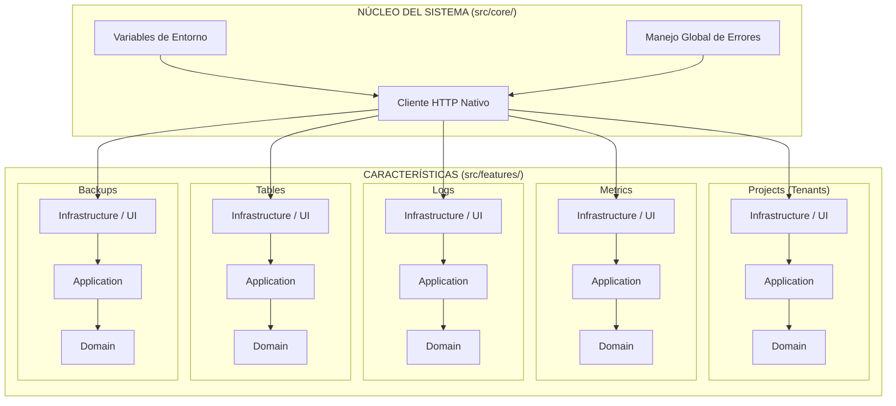

# Resumen Ejecutivo

Este documento define la arquitectura técnica para la aplicación **Dashboard de Supervisión y Control (Multi-Tenant)**. El diseño adopta el patrón de "Rebanadas Verticales" (Vertical Slicing), enfocándose en modularidad, cohesión y bajo acoplamiento.

El Dashboard opera como un cliente 100% dependiente de la red (Cloudflare Tunnel) y se separa en cinco características clave: `projects`, `metrics`, `logs`, `tables`, y `backups`.

## Diagrama de Componentes

## Registro de Decisiones de Arquitectura (ADR)

### ADR 1: Vertical Slicing para el Frontend
- **Contexto:** Se requiere construir una aplicación mantenible a largo plazo, con separación de responsabilidades y modularidad extrema.
- **Decisión:** Agrupar el código fuente no por capas tecnológicas (views/, controllers/, services/) sino por contexto de negocio (features/).
- **Consecuencias Técnicas:**
  - Facilita la comprensión del dominio de un vistazo.
  - Elimina el acoplamiento cruzado: si se elimina el módulo `backups`, la aplicación principal no se rompe.
  - Mayor cantidad de carpetas al inicio (overhead), que se compensa con organización a medida que crece.

### ADR 2: Cliente HTTP Nativo en el Core
- **Contexto:** Existe una restricción estricta ("PROHIBICIÓN DE SDKs COMERCIALES") para integraciones de red.
- **Decisión:** Implementar un Wrapper centralizado sobre `fetch` en la carpeta `src/core/http/`. Ningún componente UI realizará peticiones directas.
- **Consecuencias Técnicas:**
  - Garantiza el control absoluto sobre cómo se forman los headers y se interceptan los errores.
  - Requiere tipar manualmente todas las respuestas del servidor.

### ADR 3: UI Desacoplada y Orientada a Estados
- **Contexto:** El Frontend debe reaccionar de forma limpia a fallas en las peticiones.
- **Decisión:** Utilizar Hooks (Application Layer) que abstraen los estados `loading`, `success`, y `error` desde la Infrastructure hacia la Vista.
- **Consecuencias Técnicas:**
  - Ningún componente React tendrá condicionales crudos (ej. `if (!data) return "Loading..."`), sino que se gestionará mediante componentes modulares (ej. `<Loader />`, `<ErrorAlert />`).
